# Agent Gateway + MCP + Custom Extension Demo

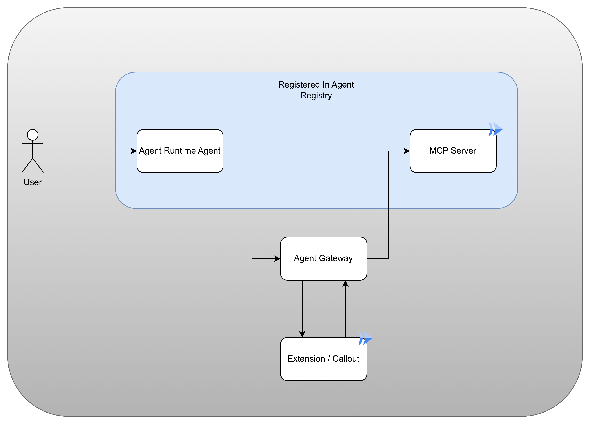

This repository has the following components:

1. An MCP server (`hotel_booker_direct_mcp`)
2. An ADK agent (`hotel_adk_agent_reg`) 
3. A Service Extension to be used to create a `CONTENT_AUTHZ` policy to intercept Agent to MCP calls. ( `debugger`). You can develop it further as per your requirements, currently it logs request and response (both header and body).


> [!NOTE]
> This deployment setup is meant to be used till you complete the extension development. After that, the extension should be deployed either as an authenticated Cloud Run Service or as a Backend Service in internal VPC (with Agent Gateway Network Attachment). Please check the "Optional" section below for more details.


## Table of Contents

- [Deployment Instructions](#deployment-instructions)
  - [Export variables and enable required APIs](#export-variables-and-enable-required-apis)
  - [MCP Server](#mcp-server)
    - [Add MCP server to the Registry](#add-mcp-server-to-the-registry)
  - [Agent Gateway](#agent-gateway)
    - [1. Create Agent gateway](#1-create-agent-gateway)
    - [2. Deploy Service Extension Ext Proc Container](#2-deploy-service-extension-ext-proc-container)
    - [3. Create Service Extension](#3-create-service-extension)
    - [4. Create CONTENT_AUTHZ policy](#4-create-content_authz-policy)
  - [Agent](#agent)
    - [Locally Testing](#locally-testing)
    - [Provide IAM Access Agent Registry to all agents](#provide-iam-access-agent-registry-to-all-agents)
    - [Deploy in Agent Runtime (Agent Engine)](#deploy-in-agent-runtime-agent-engine)
    - [Verify Agent Engine agent to MCP conversations intercepted in by Agent GW](#verify-agent-engine-agent-to-mcp-conversations-intercepted-in-by-agent-gw)
    - [Next steps](#next-steps)
    - [Debugging Agent Gateway issues](#debugging-agent-gateway-issues)
- [Optional (but recommended)](#optional-but-recommended)
  - [Enforcing Agent Gateway IAP IAM Policies](#enforcing-agent-gateway-iap-iam-policies)
    - [Register all endpoints](#register-all-endpoints)
    - [Provide access to endpoints and MCP server](#provide-access-to-endpoints-and-mcp-server)
    - [Switch enforcement on Agent Gateway](#switch-enforcement-on-agent-gateway)
  - [Non Demo Deployment](#non-demo-deployment)
  - [Capture all outbound traffic from Agent](#capture-all-outbound-traffic-from-agent)


## Deployment Instructions 

Clone this repository to Google Cloud Shell.

```bash

git clone https://github.com/nikhilpurwant/agent-gateway-demo.git

# Make sure you stay in this directory for the reminder of this setup / run
cd agent-gateway-demo


```

### Export variables and enable required APIs

```bash

export PROJECT_ID="<ADD GCP PROJECT ID HERE>"
# get the project number
export ORG_ID=<ORG_ID>
export PROJECT_NUMBER=$(gcloud projects describe ${PROJECT_ID} --format="value(projectNumber)")
export REGION="<ADD REGION HERE>"
export REPO_NAME=${REGION}-repo
export EXTENSION_NAME=cloudrun-extproc-extn
export ALL_AGENTS=principalSet://agents.global.org-${ORG_ID}.system.id.goog/attribute.platformContainer/aiplatform/projects/${PROJECT_NUMBER}
export AGENT_GATEWAY_NAME=${REGION}-gw
export PWD=`pwd`  

```

```bash
# Verify

echo $PROJECT_ID
echo $ORG_ID
echo $PROJECT_NUMBER
echo $REGION
echo $REPO_NAME
echo $EXTENSION_NAME
echo $ALL_AGENTS
echo $PWD


```

```bash
# Set project Id if not already set

gcloud config set project $PROJECT_ID

```


Make sure you run all 3 blocks 

```bash

gcloud services enable run.googleapis.com \
      artifactregistry.googleapis.com \
      cloudbuild.googleapis.com

```


```bash

gcloud services enable \
  agentregistry.googleapis.com \
  aiplatform.googleapis.com \
  apphub.googleapis.com \
  apptopology.googleapis.com \
  cloudapiregistry.googleapis.com \
  cloudtrace.googleapis.com \
  compute.googleapis.com \
  dataform.googleapis.com \
  iam.googleapis.com \
  iamconnectors.googleapis.com \
  iap.googleapis.com \
  logging.googleapis.com \
  modelarmor.googleapis.com \
  monitoring.googleapis.com \
  networksecurity.googleapis.com \
  networkservices.googleapis.com \
  notebooks.googleapis.com \
  observability.googleapis.com


```

```bash

gcloud services enable \
  securitycenter.googleapis.com \
  saasservicemgmt.googleapis.com \
  storage.googleapis.com \
  telemetry.googleapis.com \
  texttospeech.googleapis.com \
  discoveryengine.googleapis.com

```

### MCP Server

The MCP server is deployed on Cloud run.

```bash


gcloud config set project $PROJECT_ID

gcloud run deploy hotel-booker-mcp-server \
    --source ./hotel_booker_direct_mcp \
    --region $REGION \
    --allow-unauthenticated \
    --set-env-vars MCP_TRANSPORT=streamable-http

```

Note down the Service URL which looks like https://hotel-booker-mcp-xxxxxx-uc.a.run.app and export it as a variable

```bash

export MCP_SERVER_HOST=<URL without https e.g. hotel-booker-mcp-xxxxxx-xx.a.run.app>


```

#### Add MCP server to the Registry

For this task we are going to use Google Cloud Console instead of `gcloud` commands


Search for Agent platform in Google Cloud Console. Click Agent Registry on the page, then MCP servers and then Add MCP Server - as shown below in the screenshots

> [!NOTE]
> You may need to click Enable Agent Registry in case the UI presents the message to do so, even though it is already enabled above (or you can just refresh the page).

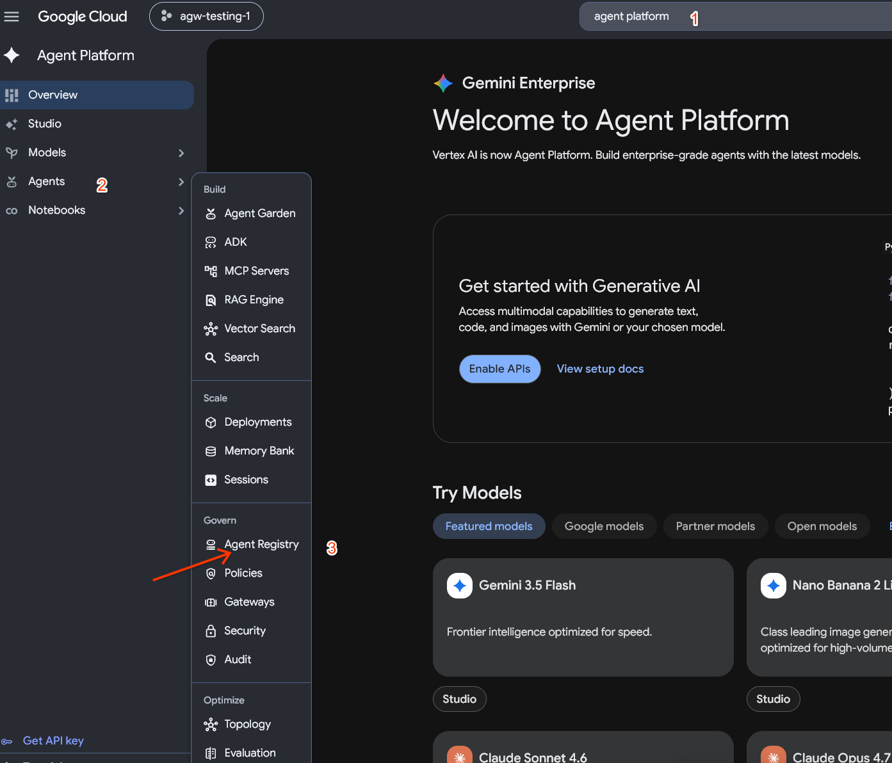

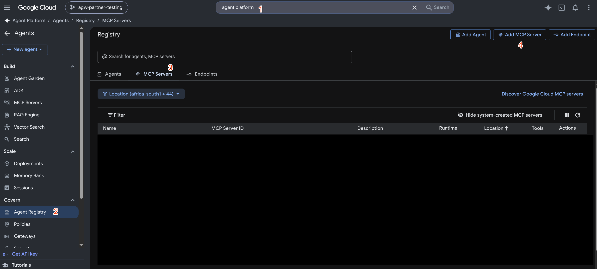


Fill in the details as shown below (use the region you have been using so far).

Copy the contents of `schema.json` from `./hotel_booker_direct_mcp` and add to `JSON` field in the screen (these are tools in our MCP server)

> [!IMPORTANT]
> When filling the MCP SERVER URL, make sure you add `/mcp` at the end of the Cloud Run URL for the MCP server. Do not use the Import Tools link.

Click Next


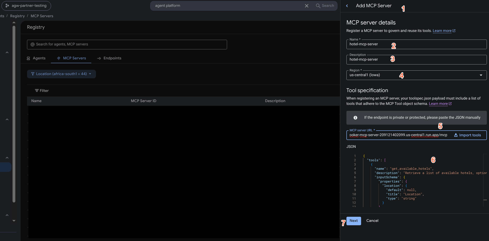

Click `Save` on the next screen.

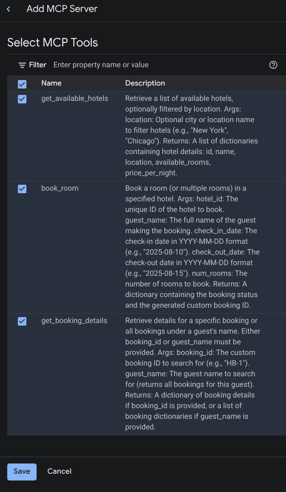

MCP server is added to the Agent Registry.
Note down the MCP SERVER NAME as shown in the diagram

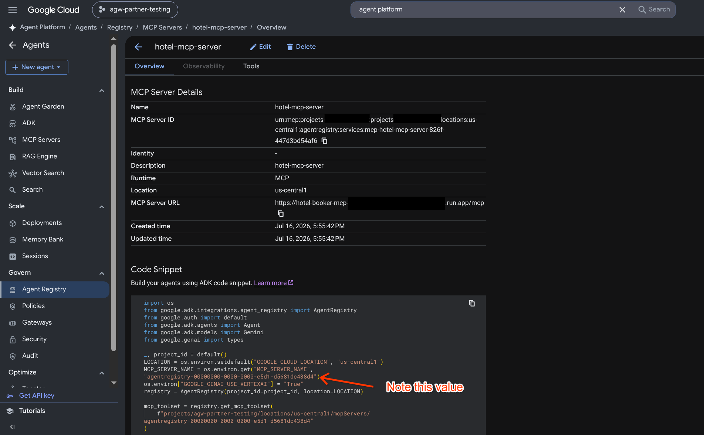


```bash

# e.g. agentregistry-00000000-0000-0000-2d19-a1259d005318
export MCP_SERVER_NAME=<ADD MCP_SERVER_NAME HERE>

```


### Agent Gateway

We are performing the following steps - 

1. Create Agent gateway
2. Deploy Service Extension Ext Proc Container
3. Create Service Extension
4. Create CONTENT_AUTHZ policy


#### 1. Create Agent gateway

For this task we are going to use Google Cloud Console instead of `gcloud` commands

Search for Agent Platform in Google Cloud Console, select Gateways and create the gateway as shown in the image below (make sure using the same region throughout)

> [!IMPORTANT]
> Please use the Agent Gateway name as `${REGION}-gw` for consistency (e.g. `us-central1-gw`). We have already exported this name as `AGENT_GATEWAY_NAME`.

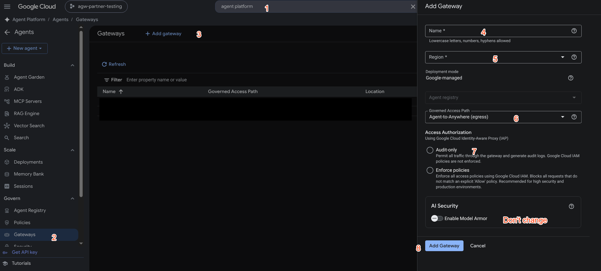

#### 2. Deploy Service Extension Ext Proc Container

```bash

# Create Repo
gcloud artifacts repositories create ${REPO_NAME} \
    --repository-format=docker \
    --location=${REGION} \
    --description="Docker repository for Service Extension Ext Proc"

```

```bash

# Configure Docker auth
gcloud auth configure-docker \
    us-central1-docker.pkg.dev

# Build Image
docker build -t $REGION-docker.pkg.dev/$PROJECT_ID/$REPO_NAME/debugger:latest ./debugger

```

```bash
# Push Image
docker push $REGION-docker.pkg.dev/$PROJECT_ID/$REPO_NAME/debugger:latest

```

```bash

# deploy as cloud run service

gcloud run deploy debugger \
  --image=${REGION}-docker.pkg.dev/$PROJECT_ID/$REPO_NAME/debugger:latest \
  --region=${REGION} \
  --use-http2 \
  --port=50051 \
  --allow-unauthenticated

```

Note down the debugger service URL e.g. debugger-xxxxxx-uc.a.run.app as `EXTENSION_HOST`

```bash

export EXTENSION_HOST=<EXTENSION_HOST from above no URL scheme (https) prefix just the hostname>

```

#### 3. Create Service Extension


```bash


#Create the YAML file
cat <<EOF > cloudrun_debugger_extension.yaml
name: projects/${PROJECT_ID}/locations/${REGION}/authzExtensions/${EXTENSION_NAME}
service: ${EXTENSION_HOST}
authority: ${EXTENSION_HOST}
timeout: 10s
failOpen: true
description: "Public Cloud Run Debugger Extension"
EOF

```

```bash

# Verify if the file is created and all values are properly populated
cat cloudrun_debugger_extension.yaml

```

```bash

# Create the Service Extension by importing this file
gcloud beta service-extensions authz-extensions import ${EXTENSION_NAME} \
  --source=cloudrun_debugger_extension.yaml \
  --location=${REGION} \
  --project=${PROJECT_ID}

```

#### 4. Create CONTENT_AUTHZ policy

```bash

cat <<EOF > authz-policy.yaml
name: projects/${PROJECT_ID}/locations/${REGION}/authzPolicies/${AUTHZ_POLICY_NAME}
action: CUSTOM
customProvider:
  authzExtension:
    resources:
    - projects/${PROJECT_NUMBER}/locations/${REGION}/authzExtensions/${EXTENSION_NAME}
policyProfile: CONTENT_AUTHZ
target:
  resources:
  - projects/${PROJECT_NUMBER}/locations/${REGION}/agentGateways/${AGENT_GATEWAY_NAME}
httpRules:
- to:
    operations:
    - paths:
      - prefix: /
  when: "request.host == '${MCP_SERVER_HOST}'"
EOF

```

```bash

# Verify if the file is created and all values are properly populated
cat authz-policy.yaml

```

```bash

# Create the CONTENT_AUTHZ policy by importing this file
gcloud beta network-security authz-policies import ${AUTHZ_POLICY_NAME} \
  --location=${REGION} \
  --source=authz-policy.yaml


```

### Agent

#### Locally Testing

Local testing does not engage the Agent Gateway, it is to verify the Agent and MCP functionality

```bash

cat <<EOF > hotel_adk_agent_reg/.env
GOOGLE_GENAI_USE_VERTEXAI=1
GOOGLE_CLOUD_PROJECT=${PROJECT_ID}
GOOGLE_CLOUD_LOCATION=${REGION}
MCP_SERVER_NAME=${MCP_SERVER_NAME}
EOF

```

```bash

# Verify if the file is created and all values are properly populated
cat hotel_adk_agent_reg/.env


```

```bash
# sync dependencies
uv sync

```

```bash
# Run the agent locally

uv run adk web ./hotel_adk_agent_reg --allow_origins "*"

```

Access the Agent on local machine http://localhost:8000 / in Web preview on Cloud Shell (change port to 8000)

##### Sample prompts

1. Hello what can you do?
2. Please get details on booking HB-1

Screenshots below - 

<details>
<summary>Cloud Shell run screenshots</summary>

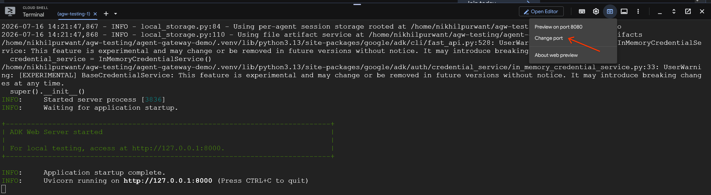

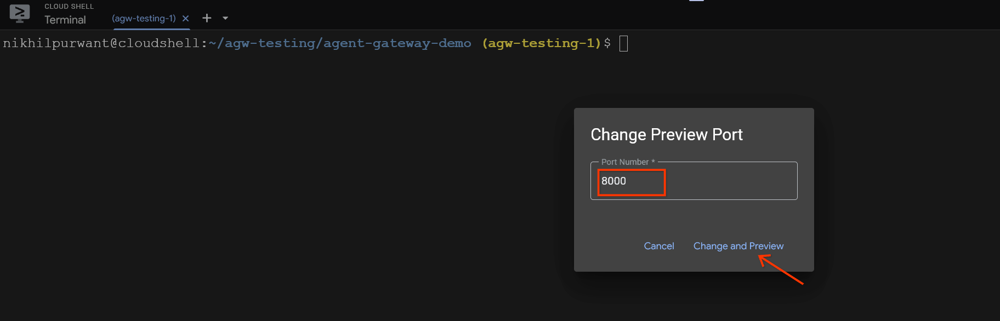

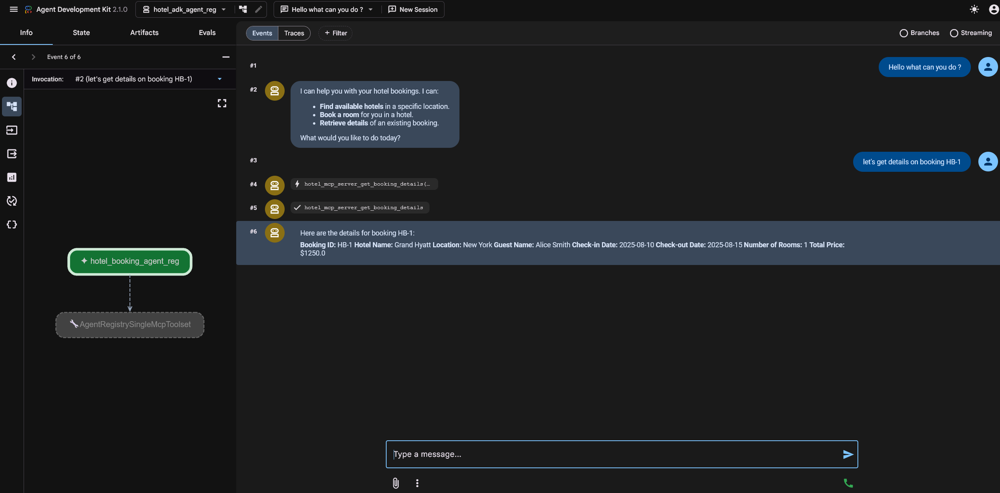

</details>

<details>
<summary>Localhost run screenshots</summary>


</details>


You can check the Cloud Run logs for MCP requests (from local agent)

#### Provide IAM Access Agent Registry to all agents

```bash
# This is needed for the Agent to boot up in the Agent Runtime / Agent Engine 
# when the Agent is using MCP from Agent Registry
gcloud projects add-iam-policy-binding ${PROJECT_ID} \
    --member="${ALL_AGENTS}" \
    --role="roles/agentregistry.viewer"

```

#### Deploy in Agent Runtime (Agent Engine)

We are now deploying the agent in agent engine, we first create a configuration to route the agent communication (EGRESS) via Agent gateway we created earlier, and then deploying the agent.

```bash

cat <<EOF > hotel_adk_agent_reg/agent_engine_config.json
{
  "agent_gateway_config": {
    "agent_to_anywhere_config": {
      "agent_gateway": "projects/${PROJECT_ID}/locations/${REGION}/agentGateways/${AGENT_GATEWAY_NAME}"
    }
  },
  "identity_type": "AGENT_IDENTITY",
  "env_vars": {
    "GOOGLE_API_PREVENT_AGENT_TOKEN_SHARING_FOR_GCP_SERVICES": "False"
  }
}
EOF

```

```bash

# Verify if the file is created and all values are properly populated
cat hotel_adk_agent_reg/agent_engine_config.json

```

```bash

# Deploy agent in Agent Runtime (Agent Engine)

uv run adk deploy agent_engine --display_name hotel_agent --agent_engine_config_file ${PWD}/hotel_adk_agent_reg/agent_engine_config.json  hotel_adk_agent_reg/

```

#### Verify Agent Engine agent to MCP conversations intercepted in by Agent GW


To run the agent in Agent Engine - 

1. Go to Agent Registry
2. Select your Agent
3. Go to playgound tab
4. Interact with the agent (check screenshot below)

<details>
<summary>
Screenshot for Agent Engine Run
</summary>

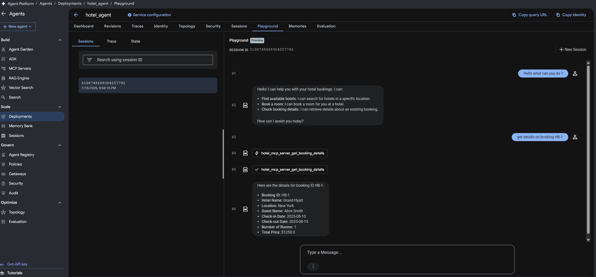
</details>

<br>

You should verify logs by using the following expressions in the logs explorer - https://console.cloud.google.com/logs


```bash

# Use one at a time

# 1. Extension logs
resource.type="cloud_run_revision"
resource.labels.service_name="debugger"

# 2. Agent Gateway logs
resource.type="networkservices.googleapis.com/Gateway"
resource.labels.location="us-central1"

# 3. MCP server logs
resource.type="cloud_run_revision"
resource.labels.service_name="hotel-booker-mcp-server"

```


#### Next steps

Now you can update the `./debugger/interceptor.py` as per your requirement and test using this setup (make sure to build and deploy new image for debugger extension everytime an update is made)

#### Debugging Agent Gateway issues

Please use the following URL - https://docs.cloud.google.com/gemini-enterprise-agent-platform/troubleshooting/troubleshoot-agent-gateway


### Optional (but recommended)

Following steps are not needed for you to develop and test your extension but are recommended when your extension is ready for production / production deployment


#### Capture all outbound traffic from Agent
Currently weare capturing only Agent to MCP traffic ([by adding HTTP rules to the CONTENT_AUTHZ policy](#4-create-content_authz-policy)). You can remove the `httpRules` section and re-import the policy which will enable interception of all Agent outbound traffic.


#### Enforcing Agent Gateway IAP IAM Policies

Until now our Agent Gateway has been in the `DRY_RUN` mode. We can switch it to enforce EGRESS access from Agent as needed by our policies.

Before we did that - we need to do the following

1. Register all endpoints the agent may access (e.g. Google ai platform API)
2. Provide IAP IAM access to endpoints to our agent
3. Provide IAP IAM access to MCP Server

Then

4. Update the Agent Gateway REQUEST_AUTHZ extension to enforced mode


##### Register all endpoints

```bash

# Make sure the REGION and PROJECT_ID environments variable are present before running the following command

uv run tools/register_endpoints.py

```

You can verify the endpoint created as shown below

<details>
<summary>
Verify Consolidated Endpoint
</summary>

Endpoint - 

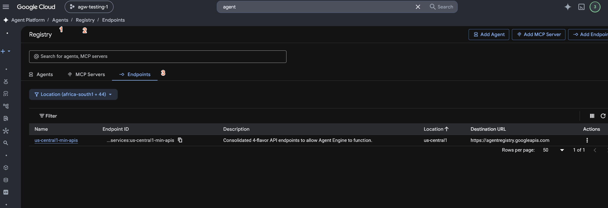


Click the endpoint to view the registered URLs (do not edit or update in console)

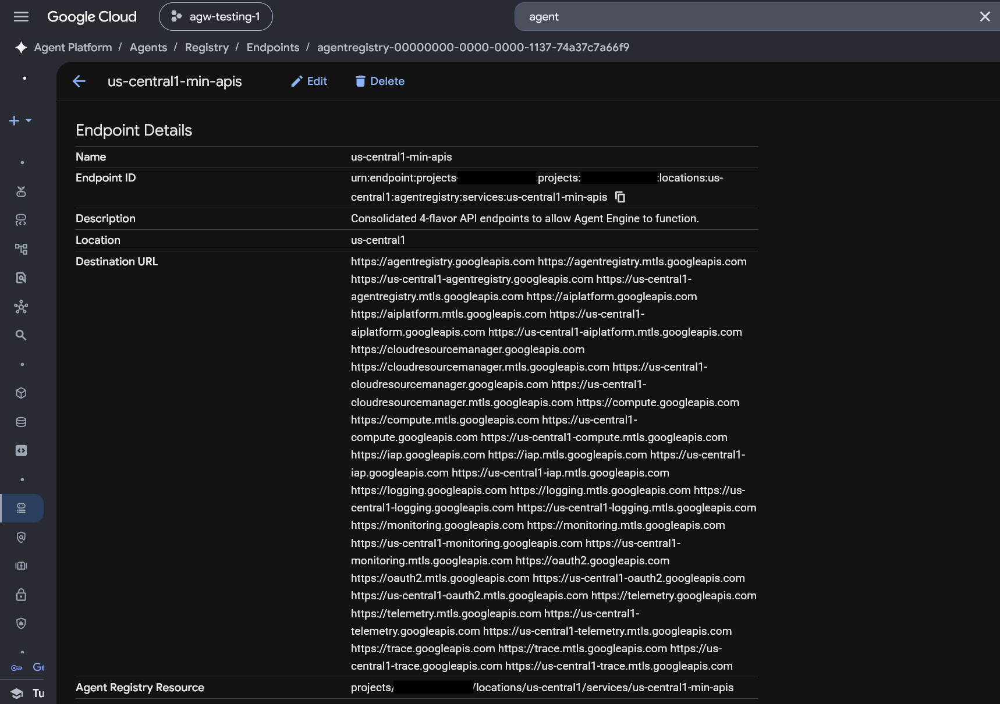


</details>

##### Provide access to endpoints and MCP server

We are going to use Google Cloud Console instead of `gcloud` commands for this task.

Use the steps shown in screenshots below to 

1. Provide access to the created endpoint to all Agents
2. Provide access to our MCP server to our specific agent

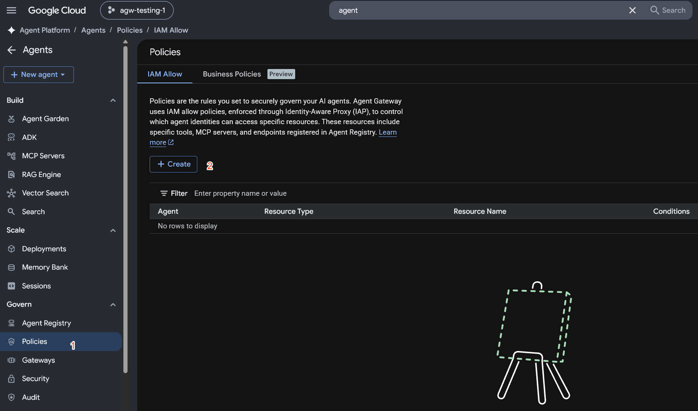

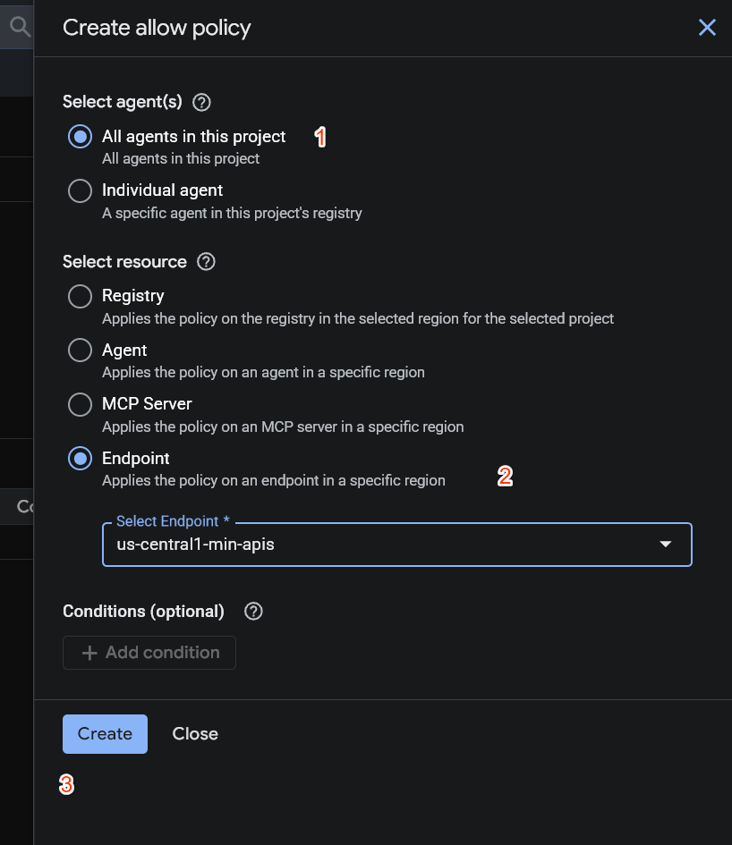

Provide MCP access to Agent

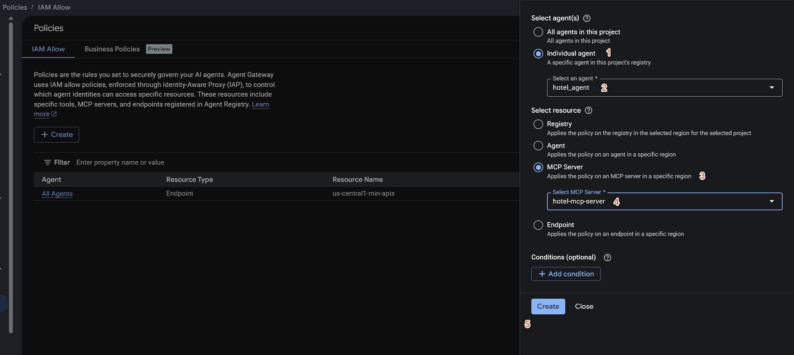

List of policies - 

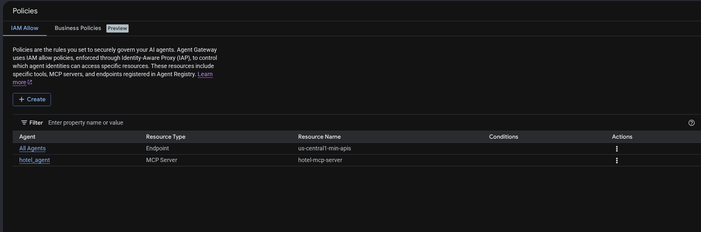

##### Switch enforcement on Agent Gateway

Run the following command to find all Auth extensions.

```bash

gcloud beta service-extensions authz-extensions list --location=$REGION

# sample output shown below

```

Notice two extensions returned

The IAP IAM policies (which we created earlier) are enforced by the IAP Authz extension (not the CONTENT_AUTHZ extension we created.)


```bash
# sample output

NAME: us-central-gw-iap-authzextension
LOAD_BALANCING_SCHEME: 
LAST_MODIFIED: 2026-07-16T18:11:56

NAME: cloudrun-extproc-extn
LOAD_BALANCING_SCHEME: 
LAST_MODIFIED: 2026-07-16T18:11:59

```

```bash
# update your-iap-authz-extension-name-here from the output above

gcloud beta service-extensions authz-extensions describe <your-iap-authz-extension-name-here> --location=$REGIO
N


```
Sample output shown below (notice the `DRY_RUN` mode)

```yaml
# Sample output

createTime: '2026-07-16T14:02:29.429415933Z'
failOpen: true
metadata:
  iamEnforcementMode: DRY_RUN
  iapPolicyVersion: V1
name: projects/agw-testing-1/locations/us-central1/authzExtensions/us-central-gw-iap-authzextension
service: iap.googleapis.com
timeout: 10s
updateTime: '2026-07-16T18:11:56.743614264Z'
```

```bash
# update name from above e.g. us-central-gw-iap-authzextension - only name not full path.
export EXTENSION_NAME=<only extension name .e.g. us-central-gw-iap-authzextension >
```

```bash
# Notice we have removed the DRY_RUN mode
# Make sure the environment variables are available

cat <<EOF > extension_update.yaml
failOpen: true
metadata:
  iapPolicyVersion: V1
name: projects/${PROJECT_ID}/locations/${REGION}/authzExtensions/${EXTENSION_NAME}
service: iap.googleapis.com
timeout: 10s
EOF

```

```bash
# verify

cat extension_update.yaml

```

```bash

gcloud beta service-extensions authz-extensions import ${EXTENSION_NAME}   --source=extension_update.yaml   --region=${REGION}

```

Now the Gateway is in enforcement mode, Go ahead and test in agent playgound and check logs as before. Noitce Agent gateway logs showing the enforcements as well.

#### Non Demo Deployment

Currently our service extension is open to internet (Option 1), however for real world use, one of the following deployment options are recommended (2-4)

For option 2 -

1. Deploy in cloud run, only allow authenticated invocations to service extension service account.
2. You can find the service account like this - `gcloud alpha network-services agent-gateways describe ${AGENT_GATEWAY_NAME}   --location=${REGION}   --format="value(agentGatewayCard.serviceExtensionsServiceAccount)"`
3. Provide `run.invoker` role. Use command - `gcloud run services add-iam-policy-binding agw-debugger  --region=europe-west2   --member="serviceAccount:service-${PROJECT_NUMBER}@gcp-sa-dep.iam.gserviceaccount.com" --role="roles/run.invoker"`. Verify the SA


For Option 3-4 require an ILB and the extension behind it. Make sure that the ILB to extension traffic is TLS enabled as required by the extension. 

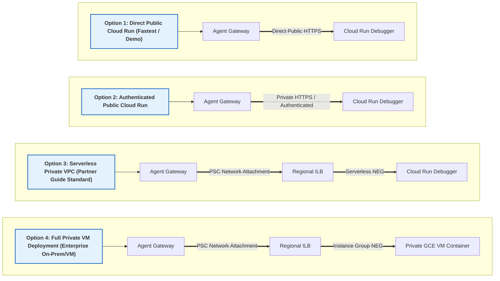


#### Capture all outbound traffic from Agent
Currently weare capturing only Agent to MCP traffic ([by adding HTTP rules to the CONTENT_AUTHZ policy](#4-create-content_authz-policy)). You can remove the `httpRules` section and re-import the policy which will enable interception of all Agent outbound traffic.
