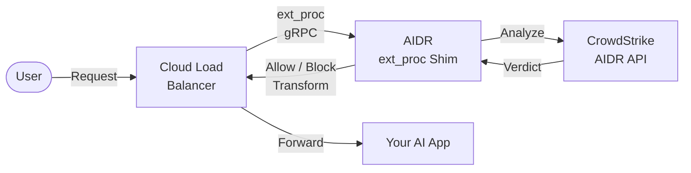

# AIDR GCP ext_proc Shim

A gRPC service that integrates
[CrowdStrike AIDR](https://www.crowdstrike.com/) (AI Detection & Response)
with Google Cloud Load Balancer's
[external processing](https://cloud.google.com/load-balancing/docs/https/ext-proc-overview)
(ext_proc) extension.

## Overview

This shim enables real-time protection for AI workloads by:

- **Detecting prompt injection attacks** before they reach your AI systems
- **Preventing data leakage** by identifying PII and sensitive data in requests/responses
- **Enforcing security policies** defined in CrowdStrike Falcon



## Quick Start

### Prerequisites

- GCP project with billing enabled
- CrowdStrike AIDR credentials (cloud region and bearer token)
- [gcloud CLI](https://cloud.google.com/sdk/docs/install) or Google Cloud Shell

### Deploy in 2 Minutes

```bash
# 1. Clone the repository
git clone <repository-url>
cd aidr-shim

# 2. Set up prerequisites
./scripts/setup-prerequisites.sh

# 3. Deploy (interactive prompts for configuration)
./scripts/deploy.sh
```

The deployment script will:

1. Validate your GCP environment
2. Create secrets in Secret Manager
3. Deploy to Cloud Run
4. Output the service URL for Load Balancer configuration

### Non-Interactive Deployment

```bash
export PROJECT_ID="your-project-id"
export AIDR_CLOUD="us-1"
export AIDR_TOKEN="your-bearer-token"

./scripts/deploy.sh
```

## Documentation

| Document | Description |
|----------|-------------|
| [User Guide](docs/USER_GUIDE.md) | Complete deployment and usage guide |
| [Configuration](docs/CONFIGURATION.md) | All configuration options |
| [Development](docs/DEVELOPMENT.md) | Local development guide |
| [Terraform](terraform/README.md) | Infrastructure-as-code deployment |

## Deployment Options

### Option 1: Shell Scripts (Quick Start)

Best for getting started quickly in Cloud Shell:

```bash
./scripts/deploy.sh
```

### Option 2: Terraform (Production)

Best for repeatable, auditable deployments:

```bash
cd terraform
terraform init
terraform apply
```

See [terraform/README.md](terraform/README.md) for details.

## Testing

Test your deployment with the included test client:

```bash
# Build test client
go build -o testclient ./test/client

# Test a payload
./testclient \
  --address=YOUR_SERVICE_URL:443 \
  --tls \
  --payload=test/testdata/clean_request.json

# Run all test payloads
./testclient \
  --address=YOUR_SERVICE_URL:443 \
  --tls \
  --batch \
  --testdata=test/testdata
```

## Project Structure

```text
├── cmd/
│   └── shim/           # Main service
├── internal/
│   ├── config/         # Configuration
│   └── server/         # gRPC server implementation
├── scripts/
│   ├── deploy.sh           # Production deployment (--debug flag for debug mode)
│   ├── setup-prerequisites.sh
│   ├── test-cloud-run.sh   # Cloud Run smoke tests
│   ├── test-local.sh       # Local Envoy integration tests
│   └── cleanup.sh          # Resource cleanup
├── terraform/          # Terraform module
├── test/
│   ├── client/        # Test client
│   └── testdata/      # Test payloads
├── docs/               # Documentation
├── Dockerfile
└── README.md
```

## Configuration

Key environment variables:

| Variable | Required | Description |
|----------|----------|-------------|
| `AIDR_CLOUD` | Yes | Falcon cloud region (e.g. us-1, us-2, eu-1) |
| `AIDR_TOKEN` | Yes | Bearer token for authentication |
| `LOG_LEVEL` | No | debug, info, warn, error (default: info) |
| `DEBUG_MODE` | No | Enable verbose logging (default: false) |
| `FAILURE_MODE` | No | `allow` (default) or `deny` — controls behavior when AIDR is unreachable |
| `ECHO_MODE` | No | Bypass AIDR scanning (requires `ALLOW_ECHO_MODE=true`) |

See [docs/CONFIGURATION.md](docs/CONFIGURATION.md) for all options.

## Agent Gateway Integration (agent-gateway-demo)

After running `./scripts/deploy.sh`, wire the shim into the Vertex AI Agent Gateway
as a `CONTENT_AUTHZ` service extension. This replaces the `debugger` ext_proc from
the main demo.

### Prerequisites

Ensure these shell variables are set (they are defined in the main demo README):

```bash
export PROJECT_ID=<your-project-id>
export PROJECT_NUMBER=$(gcloud projects describe ${PROJECT_ID} --format="value(projectNumber)")
export REGION=us-east1
export EXTENSION_NAME=cloudrun-extproc-extn
export AGENT_GATEWAY_NAME=${REGION}-gw
export AUTHZ_POLICY_NAME=agent-gateway-authz         # any name; must match if policy already exists
export MCP_SERVER_HOST=<mcp-server-hostname>         # e.g. hotel-booker-mcp-server-162536808686.us-east1.run.app
```

### Step 1 — Set EXTENSION_HOST

Use the internal hostname from the deploy output (no `https://` prefix):

```bash
export EXTENSION_HOST=<aidr-shim-hostname-from-deploy-output>
# e.g. export EXTENSION_HOST=aidr-shim-wrimo4vtla-ue.a.run.app
```

### Step 2 — Register the authz extension

```bash
cat <<EOF > cloudrun_aidr_extension.yaml
name: projects/${PROJECT_ID}/locations/${REGION}/authzExtensions/${EXTENSION_NAME}
service: ${EXTENSION_HOST}
authority: ${EXTENSION_HOST}
timeout: 10s
failOpen: true
description: "AIDR ext_proc Security Extension"
EOF

# Verify values are populated
cat cloudrun_aidr_extension.yaml

# Import (creates or updates in place — replaces the debugger extension if present)
gcloud beta service-extensions authz-extensions import ${EXTENSION_NAME} \
  --source=cloudrun_aidr_extension.yaml \
  --location=${REGION} \
  --project=${PROJECT_ID}
```

### Step 3 — Create the CONTENT_AUTHZ policy

Skip this step if the policy already exists and points at `${EXTENSION_NAME}`.

```bash
cat <<EOF > authz-policy.yaml
name: projects/${PROJECT_ID}/locations/${REGION}/authzPolicies/${AUTHZ_POLICY_NAME}
action: CUSTOM
customProvider:
  authzExtension:
    resources:
    - projects/${PROJECT_NUMBER}/locations/${REGION}/authzExtensions/${EXTENSION_NAME}
policyProfile: CONTENT_AUTHZ
target:
  resources:
  - projects/${PROJECT_NUMBER}/locations/${REGION}/agentGateways/${AGENT_GATEWAY_NAME}
httpRules:
- to:
    operations:
    - paths:
      - prefix: /
  when: "request.host == '${MCP_SERVER_HOST}'"
EOF

cat authz-policy.yaml

gcloud beta network-security authz-policies import ${AUTHZ_POLICY_NAME} \
  --location=${REGION} \
  --source=authz-policy.yaml
```

### Step 4 — Redeploy the agent

Re-run the Agent Engine deploy from the main demo so the agent picks up the new extension:

```bash
uv run adk deploy agent_engine \
  --display_name hotel_agent \
  --agent_engine_config_file ${PWD}/hotel_adk_agent_reg/agent_engine_config.json \
  hotel_adk_agent_reg/
```

### Step 5 — Verify

Trigger a tool call from the Agent Playground, then check the shim logs:

```bash
gcloud run services logs read aidr-shim --region=${REGION} --project=${PROJECT_ID} --limit=50
```

Expected log lines for a clean hotel booking interaction:

```
INFO  detected MCP payload  method=tools/list
INFO  detected MCP payload  method=tools/call
```

## MCP Protocol Behavior

| MCP event | AIDR action |
|-----------|-------------|
| `tools/list` request | Pass-through (no user content to scan) |
| `tools/list` response | Scan `result.tools[]` for tool-poisoning attacks; block if detected; transform is skipped (AIDR guard_output cannot be safely reinjected into the MCP JSON-RPC envelope) |
| `tools/call` request | Scan `params.arguments` for prompt injection / PII |
| `tools/call` response | Scan `result.content[]` / `result.structuredContent` |
| MCP error responses | Pass-through (protocol-level errors, not user content) |
| `initialize`, notifications | Pass-through |

## Next Steps After Deployment

1. **Wire into Agent Gateway**: Follow the [Agent Gateway Integration](#agent-gateway-integration-agent-gateway-demo) steps above
2. **Set up policies**: Configure AIDR policies in the CrowdStrike Falcon console
3. **Monitor**: View logs with `gcloud run services logs read aidr-shim --region=${REGION} --limit=50`

## License

Copyright CrowdStrike. See LICENSE for details.
