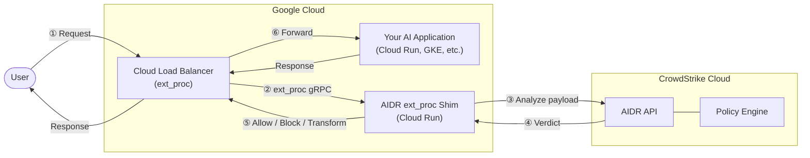

# AIDR GCP ext_proc Shim User Guide

This guide covers deploying and using the AIDR GCP ext_proc shim to protect AI workloads behind Google Cloud Load Balancer.

## Table of Contents

1. [Overview](#overview)
2. [Architecture](#architecture)
3. [Prerequisites](#prerequisites)
4. [Quick Start (Shell Scripts)](#quick-start-shell-scripts)
5. [Production Deployment (Terraform)](#production-deployment-terraform)
6. [Configuration Reference](#configuration-reference)
7. [Testing Your Deployment](#testing-your-deployment)
8. [Monitoring and Troubleshooting](#monitoring-and-troubleshooting)
9. [Next Steps](#next-steps)

---

## Overview

The AIDR GCP ext_proc shim is a gRPC service that integrates CrowdStrike's AI Detection & Response (AIDR) with Google Cloud's external processing (ext_proc) extension for Envoy-based load balancers.

### What It Does

- **Inspects AI traffic**: Analyzes request and response bodies for threats
- **Detects prompt injection**: Identifies malicious prompts targeting AI systems
- **Prevents data leakage**: Blocks or redacts sensitive information (PII, secrets)
- **Enforces policies**: Applies your AIDR security policies to all AI traffic

### Key Benefits

- **Non-intrusive**: No changes required to your AI applications
- **Low latency**: Deployed close to your load balancer in Google Cloud
- **Scalable**: Automatically scales with Cloud Run
- **Secure**: Credentials stored in Secret Manager

---

## Architecture



### Flow

1. **Request arrives** at Google Cloud Load Balancer
2. **Load Balancer calls ext_proc** shim via gRPC
3. **Shim sends payload to AIDR API** for analysis
4. **AIDR returns verdict**: allow, block, or transform
5. **Shim returns decision** to Load Balancer
6. **Load Balancer acts** on the decision (forward, block, or modify)

---

## Prerequisites

Before deploying, ensure you have:

### 1. Google Cloud Account

- GCP project with billing enabled
- Owner or Editor role on the project
- Access to Google Cloud Console or Cloud Shell

### 2. CrowdStrike AIDR Credentials

From your CrowdStrike Falcon console:

- **AIDR Cloud Region**: Your Falcon cloud region (e.g. `us-1`, `us-2`, `eu-1`)
- **Bearer Token**: API authentication token

Contact your CrowdStrike representative if you need help obtaining these.

### 3. Tools (for local deployment)

If deploying from your local machine (not Cloud Shell):

- [gcloud CLI](https://cloud.google.com/sdk/docs/install) installed and configured
- [Terraform](https://developer.hashicorp.com/terraform/downloads) >= 1.0 (for Terraform deployments)

**Note**: Google Cloud Shell has all required tools pre-installed.

---

## Quick Start (Shell Scripts)

The fastest way to deploy is using the provided shell scripts from Google Cloud Shell.

### Step 1: Open Cloud Shell

Go to [Google Cloud Console](https://console.cloud.google.com) and click the Cloud Shell icon (>_) in the top right.

### Step 2: Clone or Upload the Code

```bash
# If you have the code in a git repository
git clone <your-repo-url>
cd aidr-shim

# Or upload via Cloud Shell's upload feature
```

### Step 3: Run Prerequisites Setup

```bash
./scripts/setup-prerequisites.sh
```

This script will:

- Verify gcloud authentication
- Check and enable required APIs
- Validate IAM permissions

### Step 4: Deploy the Shim

```bash
./scripts/deploy.sh
```

The interactive script will prompt for:

- **GCP Project ID**: Your project (auto-detected if configured)
- **Region**: Where to deploy (default: us-central1)
- **Service name**: Cloud Run service name (default: aidr-shim)
- **AIDR Cloud Region**: Your Falcon cloud region (e.g. us-1)
- **AIDR Token**: Your bearer token

### Step 5: Note the Service URL

After deployment, the script outputs your service URL:

```text
Service URL (provide this to Google for Load Balancer configuration):

  https://aidr-shim-xxxxx-uc.a.run.app
```

**Save this URL** - you'll need it to configure your Load Balancer.

### Non-Interactive Deployment

For automation or CI/CD, use environment variables:

```bash
export PROJECT_ID="my-project"
export REGION="us-central1"
export SERVICE_NAME="aidr-shim"
export AIDR_CLOUD="us-1"
export AIDR_TOKEN="your-bearer-token"

./scripts/deploy.sh
```

---

## Production Deployment (Terraform)

For repeatable, auditable deployments, use Terraform.

### Step 1: Build and Push Container Image

```bash
# From the project root directory
gcloud builds submit --tag gcr.io/YOUR_PROJECT_ID/aidr-shim:latest .
```

### Step 2: Configure Variables

Create `terraform/terraform.tfvars`:

```hcl
project_id      = "your-gcp-project-id"
region          = "us-central1"
service_name    = "aidr-shim"
aidr_cloud      = "us-1"
aidr_token      = "your-aidr-bearer-token"
container_image = "gcr.io/your-project-id/aidr-shim:latest"

# Production settings
min_instances = 1    # Keep warm
max_instances = 100  # Scale for traffic
cpu           = "2"
memory        = "1Gi"
```

### Step 3: Initialize and Apply

```bash
cd terraform

# Initialize Terraform
terraform init

# Preview changes
terraform plan

# Apply changes
terraform apply
```

### Step 4: Get Outputs

```bash
terraform output service_url
```

### Remote State (Recommended)

For team environments, use GCS backend. Add to `versions.tf`:

```hcl
terraform {
  backend "gcs" {
    bucket = "your-terraform-state-bucket"
    prefix = "aidr-shim"
  }
}
```

---

## Configuration Reference

See [CONFIGURATION.md](CONFIGURATION.md) for detailed configuration options.

### Quick Reference

| Variable | Required | Default | Description |
|----------|----------|---------|-------------|
| `AIDR_CLOUD` | Yes | - | Falcon cloud region (e.g. us-1) |
| `AIDR_TOKEN` | Yes | - | Bearer token |
| `LOG_LEVEL` | No | `info` | Logging level |
| `DEBUG_MODE` | No | `false` | Verbose logging |
| `FAILURE_MODE` | No | `allow` | Behavior when AIDR is unreachable: `allow` or `deny` |
| `GRPC_PORT` | No | `8080` | gRPC server port |
| `HEALTH_PORT` | No | `8081` | Health check port |

---

## Testing Your Deployment

### Using the Test Client

The repository includes a test client for verifying your deployment:

```bash
# Build the test client
go build -o testclient ./test/client

# Test with a clean payload (should be ALLOWED)
./testclient \
  --address=aidr-shim-xxxxx-uc.a.run.app:443 \
  --tls \
  --payload=test/testdata/clean_request.json

# Test with a prompt injection payload (should be BLOCKED)
./testclient \
  --address=aidr-shim-xxxxx-uc.a.run.app:443 \
  --tls \
  --payload=test/testdata/prompt_injection.json

# Run all test payloads
./testclient \
  --address=aidr-shim-xxxxx-uc.a.run.app:443 \
  --tls \
  --batch \
  --testdata=test/testdata
```

### Test Payloads

| Payload | Expected Result | Description |
|---------|-----------------|-------------|
| `clean_request.json` | ALLOWED | Normal AI request |
| `pii_request.json` | TRANSFORMED or BLOCKED | Request with PII |
| `prompt_injection.json` | BLOCKED | Malicious prompt |
| `response_with_pii.json` | TRANSFORMED | Response containing PII |

### Cloud Run Smoke Tests

Use the provided script to verify a deployed Cloud Run service:

```bash
./scripts/test-cloud-run.sh
```

This tests the health endpoint of your deployed service.

### Verifying Results

Expected output for a successful test:

```text
[ALLOWED] clean_request.json
  Payload passed through unchanged

[BLOCKED] prompt_injection.json
  HTTP Status: 403
  Response: {"error": "Request blocked by security policy"}

=== Summary ===
Total: 4 | Allowed: 1 | Blocked: 2 | Transformed: 1 | Errors: 0
```

---

## Monitoring and Troubleshooting

### Viewing Logs

```bash
# View recent logs
gcloud run services logs read aidr-shim \
  --region=us-central1 \
  --project=YOUR_PROJECT_ID \
  --limit=50

# View more logs with higher limit
gcloud run services logs read aidr-shim \
  --region=us-central1 \
  --project=YOUR_PROJECT_ID \
  --limit=100
```

### Log Levels

Set `LOG_LEVEL` to control verbosity:

- `debug`: All messages including request/response details
- `info`: Normal operations (default)
- `warn`: Warnings and errors
- `error`: Errors only

### Debug Mode

Enable `DEBUG_MODE=true` to log full request/response bodies. **Warning**: This may log sensitive data - use only for troubleshooting.

### Common Issues

#### 1. "AIDR_CLOUD is required" Error

**Cause**: Secret Manager secrets not accessible.

**Solution**: Verify secrets exist and have correct IAM bindings:

```bash
gcloud secrets list --project=YOUR_PROJECT_ID
gcloud secrets describe aidr-cloud --project=YOUR_PROJECT_ID
```

#### 2. Connection Timeout to AIDR API

**Cause**: Network issues or incorrect URL.

**Solution**:

1. Verify `AIDR_CLOUD` is a valid cloud region (us-1, us-2, eu-1, us-gov-1, us-gov-2)
2. Check Cloud Run has outbound internet access
3. Verify AIDR service is operational

#### 3. 403 Forbidden from AIDR

**Cause**: Invalid or expired bearer token.

**Solution**: Regenerate token in CrowdStrike console and update the secret:

```bash
echo -n "new-token" | gcloud secrets versions add aidr-token --data-file=-
```

#### 4. gRPC Connection Errors

**Cause**: Load balancer configuration issues.

**Solution**: Verify:

1. Cloud Run service is using HTTP/2 (`--use-http2`)
2. Load balancer ext_proc is configured with gRPC
3. Service URL is correct

### Health Check Endpoint

The shim exposes a health check at `http://SERVICE:8081/health`:

```bash
# From within the same VPC
curl http://aidr-shim:8081/health
# Response: OK
```

---

## Next Steps

After deployment:

### 1. Configure Google Load Balancer

Provide the service URL to Google to configure the ext_proc extension on your Load Balancer.
This is typically done through:

- Google Cloud Console (Network Services → Load Balancing)
- Terraform/Infrastructure as Code
- Working with Google Cloud support

### 2. Configure AIDR Policies

In the CrowdStrike Falcon console:

1. Navigate to **AIDR** → **Policies**
2. Configure detection rules for:
   - Prompt injection attacks
   - PII/sensitive data
   - Custom patterns

### 3. Monitor and Iterate

- Review AIDR dashboard for detections
- Tune policies based on traffic patterns
- Adjust scaling parameters as needed

### 4. Production Hardening

Consider:

- VPC connector for private networking
- Cloud Armor for additional DDoS protection
- Custom domain with managed SSL
- Alerting on error rates

---

## Cleanup

To remove all deployed resources:

```bash
./scripts/cleanup.sh
```

This script removes the Cloud Run service, Secret Manager secrets, and container images created by the deployment.

---

## Support

- **Documentation**: See other files in the `docs/` directory
- **Issues**: File issues in the project repository
- **CrowdStrike Support**: Contact your CrowdStrike representative for AIDR-specific questions
